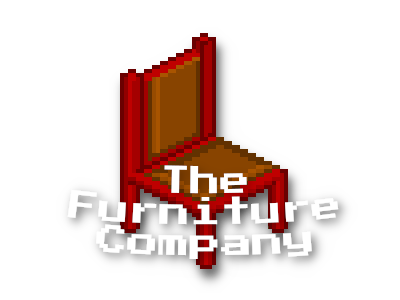

# The Furniture Company

## Documentation of the Strategy Game Version

This documentation as three main purposes:  Firstly it provides an API **documentation** on how to use the classes of the project. This should help making adjustments to the code and other customizations. The documentation can be found by navigating to the **Classes** tab.

The second Purpose is to help at setting up the project in **SosciSurvey** by providing tutorials. These can be found inside the **Tutorials** tab.

The third purpose of the documentation is to give the user a rough overview of the places where changes can be made. The corresponding tutorials can be found in the **Tutorials** tab.  

There are several options that can be adjusted to change the behavior of the game. A documentation of the different Option can be found in the **Modules** tab. Especially the modules **Constants** and **GameProperties** are interesting, because here quick adjustments can be made by changing the variables. 

